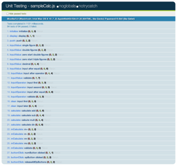

==============================
おまけ
==============================

SampleCalc作成に直接は関係しないオフトピックです。開発時にお世話になったツールなどを紹介します。

JavaScript Lint
==============================

`JavaScript Lint <http://www.javascriptlint.com/>`_

*JavaScript* 用のLintツールです。*JavaScript* はインタプリタ言語ですからコンパイル時の静的チェックが入るみたいな事がありません。さらに幸か不幸か何となくそのままできる限り実行し続けようとしてくれたり、動かなくなった時のメッセージの情報量がすくなかったりして、ちょっとしたタイポなどに気が付かずにドハマりしてしまう事があります。そんな時に役に立つのがこのツールです。

*JavaScript Lint* では様々な構文チェックと、ある程度の推奨されているスタイルにそっているかのチェックを行ってくれます。急に動かなくなったりした時は実行してみましょう。どこかでセミコロンやカンマを忘れているだけかもしれません。また、推奨されない書き方（考え方次第なので一概には言えませんけど）になっていた場合は矯正するのもいいと思います。

*JavaScript Lint* はオンラインでも実行できますし、各環境毎に用意してあるCUIツールをダウンロードして実行する事もできます。

.. note::

    ::

        bash-3.2$ jsl -process sampleCalc.js
        JavaScript Lint 0.3.0 (JavaScript-C 1.5 2004-09-24)
        Developed by Matthias Miller (http://www.JavaScriptLint.com)

        sampleCalc.js

        0 error(s), 0 warning(s)

    もちろんSampleCalcはバッチリ通ってますよ :-)

QUnit
==============================

`QUnit - jQuery JavaScript Library <http://docs.jquery.com/QUnit>`_

*QUnit* は「強力、かつ簡単」を合い言葉に開発された *JavaScript* 用のUnitTestツールです。元々は *jQuery* 専用として依存したライブラリでしたが、今では単体でも動作するようになっています。*jQuery* も *QUnit* 自体も、もちろん *QUnit* でテストされていますよ。

テストのやり方は他のUnitTestツールを使った事があればすんなり馴染めるものだと思います。それを *jQuery* 風に記述していきます。また、決まった書式でテスト実行用 *HTML* 書類を作成する事で、テスト結果を美しく表示してくれます。Ajax通信にも対応しており、工夫次第ではUIのテストもできます（私はできませんけど）。

LESS
==============================

`LESS « The Dynamic Stylesheet language <http://lesscss.org/>`_

*LESS* は *CSS* を拡張しプログラマブルに記述できるようにするプリプロセッサです。 *LESS* 自体は *JavaScript* で記述されているので、事前に変換して使う以外にもクライアントサイドやサーバサイドでも実行できます（ *Node* を使ったりして）。変数やMix-in、入れ子にできたり、引数を受け取る関数的な使い方もできるようになります。基本的に冗長な記述を排除する方向です。

.. note::

    同様に *CSS* を拡張する仕組みとしては *Sass* などもあります。

    `Sass - Syntactically Awesome Stylesheets <http://sass-lang.com/>`_

私はLESS書類の更新を監視して自動で変換するツールを愛用しています（ `LESS.app For Mac OS X <http://incident57.com/less/>`_ ）。これがなかったら *LESS* じゃなかったかも。

.. note::

    `SimpLESS - Your LESS CSS Compiler <http://wearekiss.com/simpless>`_

    こちらのアプリはクロスプラットフォームみたいです。素晴らしい :-)
