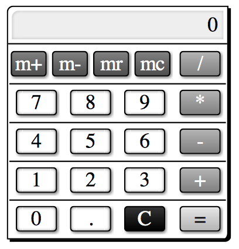

===============================
仕様を確認しよう。
===============================

さぁ、index.htmlを参照しながらsampleCalc.jsにプログラミングしていきます！　の前に仕様を確認しておきましょう。

基本仕様
========

今回目指すのは超高機能関数電卓、ではなくて極普通の一般的な電卓よりも更に更に機能を絞ったシンプルな電卓です。見た目はリアルの電卓風にボタンを表示して、それを押す事で入力を行います。ボタンは数字、小数点、四則演算子、クリア、イコールを入力できるだけ用意する必要がありそうです。これだけでは少し淋しいのでメモリー計算機能を実装するために、m+、m-、mr、mcボタンも用意しましょう。余裕があればここまで行きたいですね。そして入力値や計算結果を表示するためのスクリーンも用意します。

実際の計算の部分は *JavaScript* の実装に任せます。桁あふれや丸めなど、一切操作しません。普通に数値を渡して計算してもらってそれを表示するだけです。ボタンの機能や振る舞いなどは一般的な電卓に慣らう事にしましょう。困ったら実際に電卓を叩いてみて動作確認、確実です。

まとめると以下のようになります。

* 簡易的な電卓。
* 見た目はリアルの電卓風。
* 0〜9までの数字と四則演算、小数点、クリア、イコールを入力するボタンを持つ。
* メモリー機能に対応するために、m+、m-、mr、mcボタンを持つ。
* 実際の計算は *JavaScript* の実装にまかせ、桁あふれなどは考えない。数値の丸めも任せる。
* 細かい挙動は一般的な電卓に慣らう。

画面構成
========

次に画面構成を確認しましょう。

右の画像はindex.htmlを *OS X* 上の *Safari* で開いた場合のスクリーンショットです。環境により若干見た目に違いがありますが、基本構成は変わりません。

一番上にスクリーンがあって、その下にメモリー計算用のボタン、そして数字用のボタン、右側には演算子用のボタンを配置しました、ちょっとだけ無理矢理に。これらのボタンを操作する事によって電卓として機能します。

今のところどのボタンを押してもうんともすんとも言いませんが、それをうんとかすんとか言うようにします、できます、これから。

とりあえずの目標は四則演算が動く事、メモリー計算は出来たらいいなくらいで。

